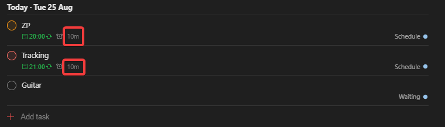
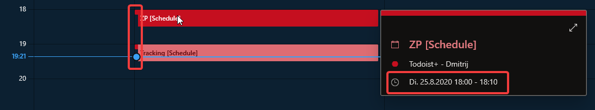

# todoist-ics-py

This python script can generate ics files for your Todoist profile.

## Setup

The simplest way to do this is to run:

```
docker-compose up -d
```

This will start a docker container that will open port 4000 (configurable).

## Format

This script uses todoist labels named `<number>m` and `<number>h`to assign durations to tasks. Examples are `15m`for 15 minutes and `2h` for two hours. The default_duration is `1h`.





## Access

Access the ics file with:

```
http://<hostname>:4000/<anyname>.ics
```

You can provide the parameters `token=<your todoist token>` and `default_duration=<default duration>`.

```
http://<hostname>:4000/<anyname>.ics?token=<your todoist token>%default_duration=15m
```

The token can also be provided through a file `./config/todoist_token`. Note however that anyone with access to your hostname can access it without adding the `token` parameter inside the URL.